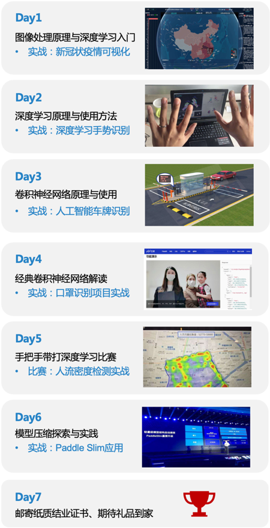

# 深度学习7日入门-CV疫情特辑 课程总结

> 深度学习7日入门-CV疫情特辑  
> 学校：飞桨深度学习学院     
> 时间：2020/03/16 - 2020/08/31  
> 简介：7大疫情AI实战案例，带你零基础入门深度学习  
> 课程地址[传送门](https://aistudio.baidu.com/aistudio/education/group/info/1149)

## 写在前面

一条意外的短信让我赶上了末班车，日后的工作八成CV的东西会偏多，刚好借着这个机会入个门了。
而且，下面划重点，

**AiStudio提供免费GPU算力**  
**AiStudio提供免费GPU算力**  
**AiStudio提供免费GPU算力**

疫情期间，作为一名即将毕业的科研狗，真香好吧！

## 课程内容目录

- [Day1 新冠疫情可视化](#Day120新冠疫情可视化)
- [Day2 实战：手势识别](#Day220手势识别)
- [Day3 实战：车牌识别](#Day320车牌识别)
- [Day4 实战：识别是否戴口罩](#Day420识别是否戴口罩)
- [Day5 比赛：人流密度检测](#Day520人流密度检测比赛)
- [Day6 模型压缩探索与实践*](#Day6%20模型压缩探索与实践)

## 总结

### 自身定位

深度学习方面，接触过深度学习的一点基本理论，做过一维时间序列的问题；调参侠(入门级别)  
CV基础：**0**

### 课程感受

1. 选题上结合了目前热点问题，很能引起人的兴趣
2. 内容安排上，我觉得我CV算入门了，cv向的一些基本问题、处理流程、简单的解决方案都有了一定的了解  
而且我自己是喜欢别人给我提供大框架，整体流程，然后细化的东西我可以自己再慢慢的深入去了解。
3. 具体的内容上，比如以实战为例，提供的代码都很详细，实践老师讲得也很细，对于新手入门可以说是很友好了。
4. 平台和团队，aistudio平台都可以提供免费GPU算力，你见过更顶的嘛？教学团队也真是很用心了，谢谢各位老师，还有悉心的助教老师。
5. 还有超级厉害的学习伙伴，真的是比你优秀得多得人还比你努力得多，咸鱼我摊牌了，共勉吧。

后续还会其它入门级以及进阶级等不同课程的开放，抓紧这个最后的超长假期的最后一点点时间好好多充实一下自己啦！
